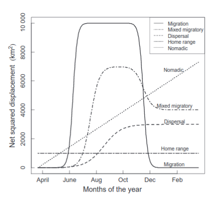

```{r setup, include=FALSE}
library(tidyverse)
knitr::opts_knit$set(root.dir = here::here("01 Introduction"))
knitr::opts_chunk$set(
  echo = TRUE, warning = FALSE, message = FALSE, 
  fig.height = 3, dev = "png", cache = FALSE, out.width = "85%", res = 600,
  comment = "", fig.align = "center")
options(width = 70, str = strOptions(strict.width = "wrap"))
theme_set(theme_light()) 
```

# Welcome!

- Welcome to this online course on animal movement. 
- We are Brian and Johannes.
- Who are you?

# Outline of the course

### Day 1:
- Introduction and exploratory data analysis for movement data (J)
- Quantifying space use of animals with home ranges (B)

### Day 2:
- Continuous time movement models (B)
- Identifying different behavioral states in movement data (J)

----

### Day 3:
- Introduction to habitat selection (B)
- Integrated step selection functions 1 (J)


### Day 4:
- Simulations from fitted iSSF (J)
- Integrated step selection functions 2 (B)

### Day 5:
- Strategies to model multiple animals (J) 
- Validation of models for habitat selection (B)
- Time to discuss questions related to **your** projects. 

--- 

## Some logistics

- The course is scheduled from Monday (24th of Jan) to Friday (28th of Jan) from 2pm to 8pm Berlin time (that is UTC+2). 

- We split these 6h block into two chunks: 
  - 2pm - 4:45 pm and 5:15 pm to 8pm
  - Each chunk will consists of 
    - a short lecture 
    - an R walkthrough
    - an exercise
    - discussion of the exercise
    
- Lectures will be held via zoom.
- During the whole workshop we have a slack channel where you ask questions (we will monitor the channel during the course, feel free to ask questions there also outside the course houres).

# Analysis of movement data in R

- The statistical software package R has become a widely used tool for data analysis in ecology and evolution and also in movement ecology. 

- A typical analysis usually undergoes a few steps (all of which can be performed in R), this was reviewed by [Joo et al. 2020](https://besjournals.onlinelibrary.wiley.com/doi/full/10.1111/1365-2656.13116). 

```{r, echo = FALSE, out.width="75%", fig.cap="Figure from Joo et al 2020"}
knitr::include_graphics(here::here("01 Introduction/img/joo2020.png"))
```

----

## Packages that we will use

- `amt`
- `ctmm`
- `crawl`
- `moveHMM`
- ...

See also `required_packages.R` for a list of all packages that we need and to get the latest version of all packages. 

# Some conventions in R

- `%>%` or `|>`: Pipes the output of one function to a next function. We will discuss this further later on. 
- `::` to access a name space form a package. 
- use of \`a\`. 
- `.` means this directory
- `..` refers to the parent directory
- `data.frame` or `tibble`?

----

- We often use `here::here("path to a file")`, when reading in a file. 
- The first `here` calls the function `here()` from the package `here`. 
- The function `here()` dynamically creates the absolute path to the project root. 

```{r}
here::here()
```

This means, that we save all our data in the root directory data (even though my scripts are in different sub directories). 

----

### Brackets (`(`, `[`, `{`)

- round brackets or parentheses (`(`) usually indicate functions or are used in arithmetic calculations. 

```{r}
sqrt(3)
```

or 

```{r}
2 * (3 + 1)
```

---

- square brackets (`[`, `[[`) are used to subset data structures. 

```{r}
letters[1:3]
```

or 

```{r}
head(iris[["Species"]])
```


-----

- curly brackets or braces (`{`) are used to form code blocks (e.g., inside a function or control structure). 


```{r, eval = FALSE}
for (i in 1:10) {
  i^2
} 
```

-----

### Functions

- Functions *do* something. For example function `sqrt()` takes the square root for a number. 
- It is easy to recognize functions, because they usually have a name (e.g., `sqrt`) followed by round brackets `()`. 
- Within these round brackets arguments are passed to a function. This arguments can be named or unnamed (as long as they are in the correct order). 

# Recommended setup

- We would recommend to download the whole repository from GitHub (@TODO Link)^[If you are familiar with git, feel free to clone the repository]. 

- Then use the RStudio project (together with RStudio).
- Following these guides, you should have all paths correct. 

# Geographic data in brief

- Movement data is inherently spatial. 
- Thus we will have to deal with tools to work with spatial data (R has a rich set of tools to deal with spatial data; e.g. https://geocompr.robinlovelace.net/).

- We will work frequently with raster data (spatial covariates) and possibly with vector data (i.e., home ranges).

- One of the challenges is to ensure that both -- tracking data and covariates -- have a matching coordinate reference system (CRS). 

---

- The CRS defines the reference system that is being used to explicitly reference a feature in space. 
- There are two classes of CRS: **geographic** (e.g., WGS84) and **projected** (e.g., UTM) CRS. 
- Project CRS flatten the three dimensional data to the a two-dimensional plane (and introduce some distortion). \pause
- CRS are often referred to with their EPSG^[EPSG stands for European Petrol Survey Group, who came up with the system.] code.
- EPSG codes are four to five digits number that refer to different CRS. See for example www.epsg.io. \pause
- Which CRS is best to use? It depends on the range of the study species. I usually prefer projected CRS, because their units are meters and not degrees. 

# Take-home messages 1

1. Do not get confused by `::`, this is just explicitly calls a function from a package.
2. Consider using RStudio projects to have everything in one place. \pause
3. Coordinate reference system (CRS) are used to describe where our animals are. 
4. EPSG-Codes can be used to refer to CRS. 

# Your turn 1

What does the following R code do

```{r, eval = FALSE}
a[8]
```


1. It calls a function `a` with the argument `8`?
2. It returns the 8th element of a vector called `a`?
3. It returns the 8th element of a data frame called `a`?


# Data
## Movement data
- Often times the data we receive is just a time series of coordinates (longitude, latitude and time stamp). 
- Depending on the sensors we use, other (meta) information may also be stored (this could include temperature, coordinates in a different [projected] CRS, ...).


----

## Environmental covariates 
- Vector layers (e.g., road networks, rivers, protected areas)
- Raster layers (e.g., land use, remotely sensed data such as NDVI, climatic variables. )


# Tracks and bursts: the basic building block

- For movement data, we usually read a text file into R (`.csv`, `.txt`, ...) as a data frame and then create a analysis-specific object. 

- When working with the `amt` package the function `make_track()` takes a sequence of coordinates (with or without timestamps) and creates a track. Note, at this point multiple individuals can be mixed and sampling rates can be heterogeneous. 

----

- **Bursts** can be created from tracks. 
- A burst is a sequence of (re)locations from the **same** individual at **equal** time intervals (with some tolerance).
- Options to change from tracks to bursts are: 
  1. Use the function `amt::track_resample()`. 
  2. Use a continuous time movement model (module 3). 
  
---

## Detecting outliers

- Before resampling data, it is a good idea to check for outliers and remove erroneous locations. 
- Location error is the difference between the recorded location an the animal's true location (Bjorneraas et al. 2010). 
- This includes locations that are obviously outside the study area. 
- One measure of accuracy for GPS data is the DOP (Dilution of Precision). Lower values are better.
- See Bjorneraas et al. 2010 for more sophisticated approach.

# Sampling rates, and resampling


- The function `summarize_sampling_rate()` takes an track as input and gives a summary of the sampling rate.
- If there are multiple animals present, there is also the function `summarize_sampling_rate_many()`, which will do the same thing, but for many animals.

---

-  Once a suitable sampling rate is determined, the function `track_resample()` can be used to take a relocation every predefined time interval (e.g., 30 minutes, 2 hours, ...) within a tolerance.
- The result of `track_resample()` is again a track with one additional column called `burst_`. 

# Take-home messages

- Movement data are often 'just' text files.
- The `amt` package uses tracks as the basic building block. 
- A burst is a track (or a part of a track) with a regular sampling rate.
- Use `track_resample()` create tracks with equal sampling rates.

# Your turn

You tracked a red fox and want to calculate average step length, why is it important to have a regular sampling rate?

1. It does not matter.
2. We can not assume that the step length is independent of the sampling rate.
3. Shorter sampling rates will lead to shorter steps. 


# Movement characteristics (`sl_`, `ta_`)

Tracks are still *just* the points as they were collected. If we want to get insights, we have can look at different characteristics of steps (i.e., two consecutive relocations). 

This include: 

- step length
- turn angle
- speed
- Net squared displacement

Note, unless you take care of different instances or bursts, they are ignored. 

----

# Net Squared displacement (NSD)

- The NSD is the squared distance between the first relocation of a track and the every relocation that follows.
- Bunnefeld et al. 2011 described different forms of the NSD that resemble different migratory behaviors.
- The different models can fit to the data (e.g., using nonlinear least square with the function `nls()` in R). 

---

```{r, echo = FALSE, out.width="60%", fig.cap="Figure taken from Bunnefeld et al. 2011"}

```

# Time of the day

- Time of day can be annotated to steps with the function `amt::time_of_day()`. This will add an additional column to the data frame of steps `tod_end` or `tod_start` depending on the argument `when`.
- If the data is of sufficient temporal resolution, it is also possible to annotate twilight (dawn and dusk). 


# Steps

We can start to create a `steps`-representation.

```{r, echo = FALSE, out.width="50%"}
knitr::include_graphics(here::here("01 Introduction/img/steps.png"))
```

This can be achieved with the function `amt::steps()`. If we resampled the data previously, we can even use `amt::steps_by_burst()`. 

-----

This automatically calculates several step attributes: 

- Start and end point
- Step length
- Absolute and relative turn angles
- Duration

This allows already calculate some step characteristics. It becomes even more informative, if we pair this for example with the whether a step was in the night, day or twilight. 

# Example

Remington Moll observed a (rare) long distance dispersal for White Tail deer^[Moll et. al Ecology and Evolution; https://onlinelibrary.wiley.com/doi/full/10.1002/ece3.7354.] and looked at the turn angle and step distribution for day and night. 

```{r, echo = FALSE}
knitr::include_graphics("img/moll3_part.jpg")
```


# Take-home message

1. Movement characteristics (e.g., step length or turn angle) are fundamental to many analyses in discrete time. 
2. We often compare movement characteristics for different times of day. 
3. The Net Squared Displacement (NSD) can be used to infer different migratory modes. 

# Your turn

How would you interpret the following figure of a step-length distribution?

```{r, echo = FALSE, fig.width=7, fig.height=4}
x <- seq(0.1, 50, by = 0.1)
plot(x * 10, dgamma(x, shape = 1, scale = 3) * 0.4 + 
  dgamma(x, shape = 9, scale = 3) * 0.6, type = "l", 
  xlab = "Step length [m]", 
  ylab = "Density")
```

# Dealing with multiple animals

- Most telemetry studies deal with more than one animal. 
- Dealing with multiple animals can complicate analyses significantly. 
- Some packages provide an infrastructure to deal with multiple animals (e.g. `adehabitat`, `move`). 
- `amt` has very limited support for dealing with multiple animals, but relies on the infrastructure provided by the `purrr` package.

---

## A slightly deeper look at R

- `tibbles` are *modern* data frames. 
- A tibble can have list columns.
- A list is an other data structure in R, that can hold any other data structure. 

With list columns it is easy to have more complex splits of your data (e.g., animals/seasons/weeks). 

# Lists

## What is a list?

Lists are yet an other data structures for R. Lists are can contain any object (even other lists). 


```{r}
l <- list("a", b = 1:10, x = list(list(1:10)))
str(l)
```

-----

## Examples for lists

```{r}
x <- list(a = 1:3, b = list(1:3))
x[[1]]
x$a
x[["b"]]
```

# Functional programming in R

## What is functional programming?

> Simply put, FP is exactly what it sounds like. If you are doing something more than once, it belongs in a function. In FP, functions are the primary method with which you should carry out tasks. All actions are just (often creative) implementations of functions you’ve written. [towardsdatascience.com](https://towardsdatascience.com/cleaner-r-code-with-functional-programming-adc37931ef7a)

----

## The `apply`-family

These functions apply a function on a `matrix`, `vector` or `list`. 

For matrices:

- `apply` (we wont cover this here in more detail)

For vectors and lists

- `lapply`
- `sapply`

----

## `lapply`

To apply a function to each element of a list (or a vector) and the result should be a list, then `lapply` can be used.

```{r}
l <- list(1:3, 2)
lapply(l, length)
```

-----

Here it would make more sense to use `sapply` (R will try to simplify the data structure of the result).

```{r}
sapply(l, length)
```

------

Note, we used the shortest possible way, it is also possible to explicitly work with the object the function is applied to.

```{r}
sapply(l, function(x) length(x))
```

Since `length` only uses one argument (here `x`), we do not have to explicitly call the function


------

The `purrr` package provides a more type stable way to `*apply()` functions. These are called `map_*()`.

- `lapply` -> `map`
- `sapply` -> `map_*`
    - `map_lgl` for logical values
    - `map_dbl` for doubles
    - `map_int` for integers
    - `map_chr` for text

In addition there variants of all `map*` functions take two inputs (`map2_*`) and many inputs (`pmap*`).


------

```{r}
library(purrr)
map(l, length)
```

Better 

```{r}
map_int(l, length)
```

-----------

Again, it is possible to access the object directly. This can be done as before with `function(<var>)`, or by default with `.` or `.x` together with `~`.

```{r}
map_int(l, function(x) length(x))
map_int(l, ~ length(.))
map_int(l, ~ length(.x))
```


----------

An example for `map2_*`:

```{r}
a <- 1:4
b <- 4:1

map2_dbl(a, b, ~ .x + .y)

```


## Nest and unnest

An example data set

```{r}
set.seed(12)
dat <- data.frame(
  id = rep(1:10, each = 10), 
  x = runif(100), 
  y = runif(100)
)
```

--------

We can use `nest` and `unnest` to create so called `list`-columns.

```{r}
dat %>% nest(data = c(x, y))
```


------------

```{r}
dat %>% nest(data = -id)
```


-------


We can then work on the nested column(s), using `mutate` in combination with `map_*`:

```{r}
dat %>% nest(data = -id) %>% 
  mutate(centroid.x = map_dbl(data, ~ mean(.x$x)))
```

# Take-home messages

1. Available data structures can be used to deal with multiple animal. 
2. Lists are just other "containers" to hold some data structures. 
3. List columns are a great way to organize complex data structures.

# Your turn

Using the data set from before, what is the type of the new column?

```{r, eval = FALSE}
dat %>% nest(data = -id) %>% 
  mutate(centroid = map(data, ~ colMeans(.)))
```
1. A list
2. Numeric
3. Double


# Data sets that we use

- We will use several data sets during this course including a data set on fishers, elephants and deer. 
- Feel free to use your own data during the exercises, we are happy to help to get it into shape. 
- For the R walkthrough we often simulate data. We believe if understand how data is generated it is much easier to understand how a specific method works. 

# Key resources/publications

\footnotesize

## Movement ecology 

- Bunnefeld, N., Börger, L., van Moorter, B., Rolandsen, C. M., Dettki, H., Solberg, E. J., & Ericsson, G. (2011). A model‐driven approach to quantify migration patterns: individual, regional and yearly differences. Journal of Animal Ecology, 80(2), 466-476.
- Bjorneraas et al. 2010: Screening Global Positioning System Location Data for Errors Using Animal Movement Characteristics. https://doi.org/10.1111/j.1937-2817.2010.tb01258.x
- Joo, R., Boone, M. E., Clay, T. A., Patrick, S. C., Clusella‐Trullas, S., & Basille, M. (2020). Navigating through the R packages for movement. Journal of Animal Ecology, 89(1), 248-267.

## R resource
- Lovlace, R. et al. (2019). Geocomputation with R: https://geocompr.robinlovelace.net/. 
- Wickham, H. R for data science: https://r4ds.had.co.nz/