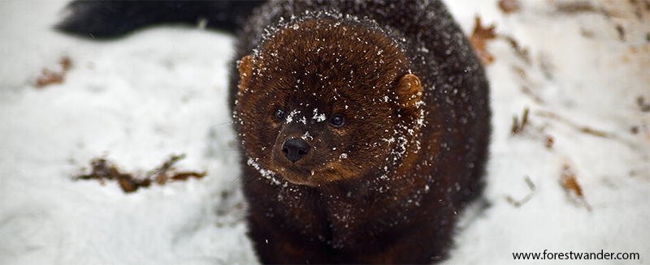

```{r setup, include=FALSE}
options(htmltools.dir.version = FALSE)
library(RefManageR)
BibOptions(check.entries = FALSE, bib.style = "authoryear", style = "markdown",
           dashed = TRUE)
bib <- ReadBib(here::here("02 Home Ranges", "02_refs.bib"))
```

class: center, middle, inverse

# Home Ranges
## Quantifying space use of animals

Brian J. Smith  
24 January 2022

*Analysis of Animal Movement Data in R*  
J. Signer & B. Smith  

---
class: center, middle

# What is a home range?

---
  
## Classic definition

> "That area traversed by the individual in its normal activities of food gathering, mating, and caring for young. Occasional sallies outside the area, perhaps exploratory in nature, should not be considered as part of the home range."

&#8212; Burt 1943

---
name: mod-def

## Some modern definitions

---

template: mod-def

> "Home ranges are the spatial expression of behaviours animals perform to survive and reproduce. These macroscopic patterns are determined by a large number of single movement steps, each of which results from the interactions among individual characteristics, individual state, and the external environment, and the moving animal in turn modifies both its individual state and the external environment. Home ranges are hence the resultant patterns of dynamic processes, which has profound consequences for the population-level effects of home range behaviour."

&#8212; Börger et al. 2008

---

template: mod-def

> "We propose that a home range is that part of an animal’s cognitive map that it chooses to keep up-to-date with the status of resources (including food, potential mates, safe sites, and so forth) and where it is willing to go to meet its requirements (even though it may not go to all such places)."

&#8212; Powell and Mitchell 2012

---
class: inverse
## Take-home messages

- Home ranges *emerge* from a complex interplay of different factors:
    + the heterogeneous environment
    + the organism's internal state
      - its current needs/drivers
      - its cognitive map
    + the organism's movement capacity

- Home-range estimation should be question driven, recognizing that home ranges, *per se*, are not typically the focus of biological interest (Fieberg and Börger 2012).

---
class: center, middle

# Estimating the home range

---

## A criticism of the classic definition

> "The conceptual definition of home range given by Burt (1943) lacks an objective, mathematical description that can be statistically estimated from data. We view relocation data as a sample of a much longer, continuous trajectory that is only one of many possible movement-path realizations of a continuous-time stochastic process."

&#8212; Fleming et al. 2015
 
---

## Two targets for estimation

- ### Range distribution

- ### Occurrence distribution

---

## Two targets for estimation

- ### Range distribution

> "The range distribution addresses the lifetime space requirements of an animal and provides a metric that can be compared across individuals."

&#8212; Fleming et al. 2015
<br>

--
- ### Occurrence distribution

> "... where an animal was located during the observation period."

&#8212; Fleming et al. 2015

---

## Two targets for estimation

.center[  ]

---

## Two targets for estimation

.center[  ]

---

## Two targets for estimation

.center[  ]

---

## Types of estimators

--

### Geometric
- Constructed following a set of rules; often hull-based.
- Based on the observed locations.

--

### Probabilistic
- Rely on an underlying probabilistic model used to construct a **utilization distribution (UD)**.
- Can be represented as a hull by outlining a cumulative probability of use.

---
## Illustrating estimators

.pull-left[
We will illustrate some geometric and probabilistic estimators using example data from a published dataset on fishers (*Pekania pennanti*) from New York, USA (LaPoint et al. 2013).



The example data are also available in the package `amt`.
]

.pull-right[  ]

---

name: geom
## Geometric estimators

---
template: geom

Geometric estimators rely only the observed data.

Therefore, they always estimate the occurrence distribution.

---
template: geom

.pull-left[
### Minimum Convex Polygon (MCP)

- 100% MCP: The smallest polygon that encompasses 100% of the locations without any concave sides (all interior angles ≤ 180°).

- Smaller MCPs can be created by excluding the most extreme locations.
  + *E.g.*, a 95% MCP excludes 5% of the most extreme locations before fitting an MCP.
]

.pull-right[]

---
template: geom

.pull-left[
### Local Convex Hull (LoCoH)
- Constructs small MCPs around every location and groups of its "neighbors".
- Nearby hulls are the successively merged to create an isopleth containing $x$ % of the locations.
- Smaller isopleths are more intensively used.
  - Approximates a UD.
- Resulting home range can contain sharp edges and holes.

.note[ See Getz et al. (2004, 2007) for details. ]
]

.pull-right[  ]

---
template: geom

.pull-left[
### Local Convex Hull (LoCoH)
- Neighborhoods can be defined by one of several algorithms
  - Fixed points **k-LoCoH**: Each hull contains the focal point and its $k-1$ nearest neighbors
  - Fixed radius **r-LoCoH**: Each hull contains all points within a radius $r$ of the focal point
  - Adaptive **a-LoCoH**: Each hull contains all points within a variable radius such that the sum of the distances between the points and the focal point is $\leq a$.
]

.pull-right[  ]

---
name: prob

## Probabilistic estimators

---
template: prob

Probabilistic estimators are constructed from an underlying statistical model for the UD.

They might estimate the occurrence distribution *or* the range distribution.

---
class: center, middle 

*But first,* 

### What is a UD?

---
### What is a UD?

.pull-left[
> The utilization distribution is "a probability distribution ... for the use of space with respect to time. That is, the utilization distribution usually calculated shows the probabilities of where an animal might have been found at any randomly chosen *time*."

&#8212; Powell and Mitchell 2012
]

.pull-right[]
---
template: prob

.pull-left[
### Kernel Density Estimator (KDE)

- Kernel density estimation is a general problem in statistics. 
  - (estimating a continuous PDF from discrete samples)
- Smooths over the locations using a weighted window, the "kernel".
- Sensitive to choice of "bandwidth" parameter (size of the kernel).
- Estimates the **occurrence distribution**.

]

.pull-right[]

---
template: prob

.pull-left[
### Autocorrelated Kernel Density Estimator (aKDE)

- Based on an underlying continuous-time movement model (next module).
- Uses autocorrelation in the movement data to estimate the smoothing parameter.
- Estimates the **range distribution**.

.note[ See [Silva et al. 2021](https://doi.org/10.1111/2041-210X.13786) for a recent review and practical guide for aKDE estimation. ]
]

.pull-right[]

---
class: inverse

## Take-home messages

- Home range estimators can target either of two distributions:
  - Occurrence distribution: where the animal was during the study period
  - Range distribution: where the animal could be found at any future time if its movement process remains the same.
  
- Geometric estimators only rely on observed data and can only estimate the occurrence distribution.

- Probabilistic estimators are based on an underlying model for the UD. They can estimate the occurrence distribution or the range distribution depending on the underlying model.

---

class: center, middle

# Questions?

---

class: small-font

# References


```{r, results='asis', echo=FALSE}
NoCite(bib)
PrintBibliography(bib, .opts = 
                    list(no.print.fields = c("issn", "url")))
```