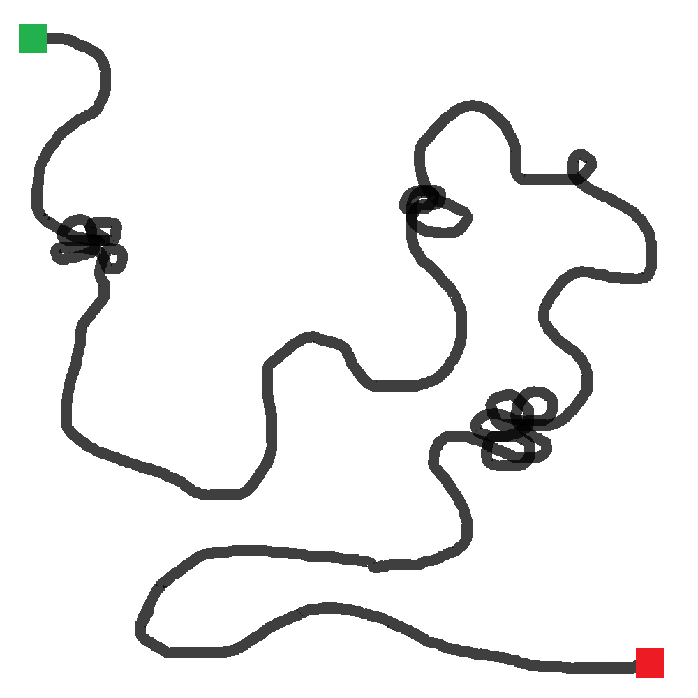
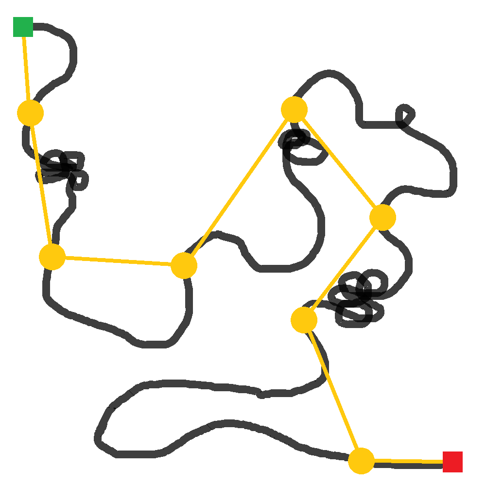
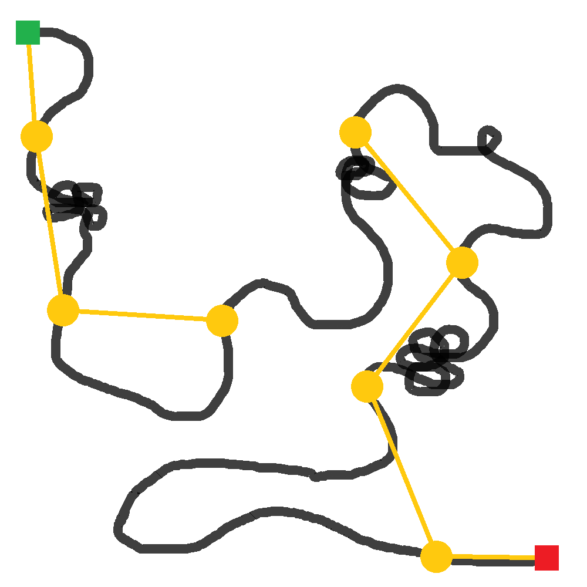
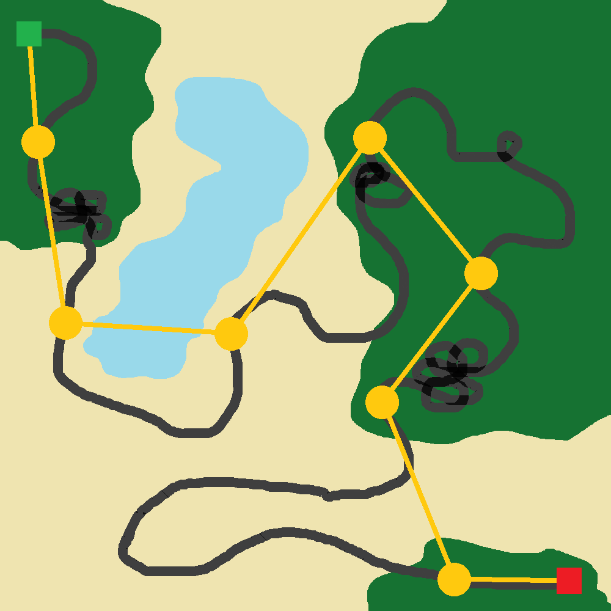
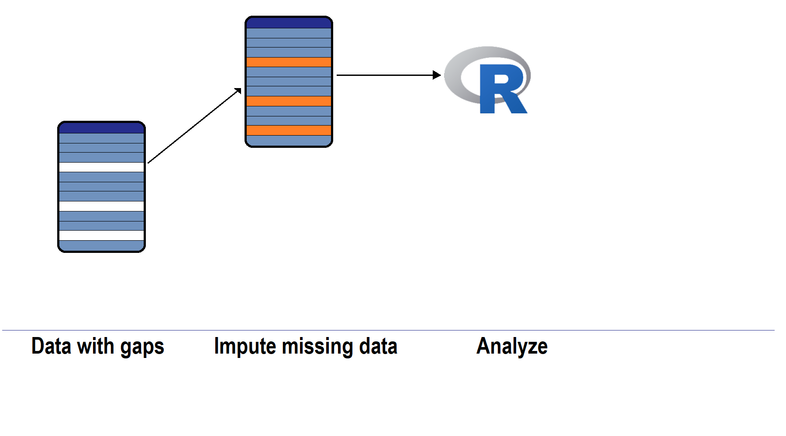
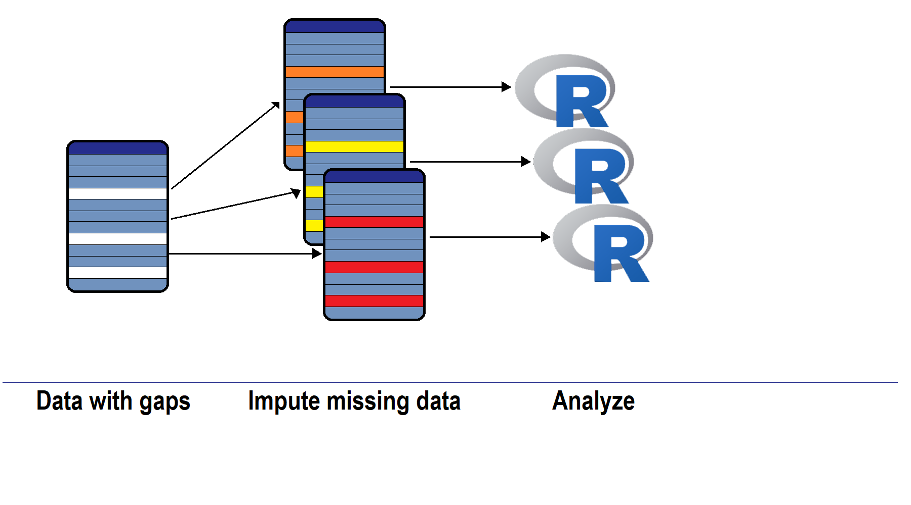
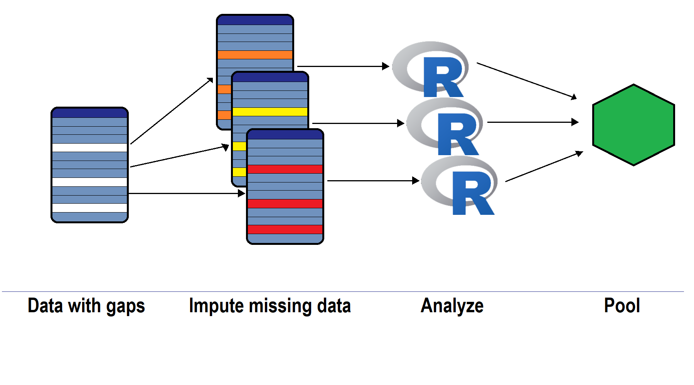

```{r setup, include=FALSE}
options(htmltools.dir.version = FALSE)
library(RefManageR)
BibOptions(check.entries = FALSE, bib.style = "authoryear", style = "markdown",
           dashed = TRUE, hyperlink = "to.doc")
bib <- ReadBib(here::here("03 CTMM", "03_refs.bib"))
```

class: center, middle, inverse

# Continuous-time Movement Models
## ⌚

Brian J. Smith  
25 January 2022

*Analysis of Animal Movement Data in R*  
J. Signer & B. Smith  

---
class: center, middle

# Continuous vs. Discrete Time

---
.pull-left[
## Continuous vs. discrete time

> "Moving animals trace continuous paths through space. However, in order to record and analyze the pattern of their movement the essential characteristics of an observed path have to be represented in a discrete form suitable for computer storage and analysis... Note that this empirical approach to representing paths fits well with the theoretical framework of discrete random walks."

&#8212; Turchin 1998, p. 128]

.pull-right[]

---
.pull-left[
## Continuous vs. discrete time

> "The discrete-time context is valuable because (1) a wealth of tools can be borrowed from the time series literature, (2) the dynamics are easily conceptualized in discrete time, and finally, (3) we are implementing models digitally on computers, thus we must discretize ... One could argue, however, that the true process of movement really occurs in both continuous time and continuous space."

&#8212; Hooten et al. 2017, p. 189]

.pull-right[]

---
class:center, middle


---
class:center, middle


---
## Continuous vs. discrete time
.pull-left[
### Why discrete time?

- Animal movement is observed at discrete intervals.
- Step lengths and turn angles drawn from stochastic distributions at discrete times are intuitive to understand.
  + Fitted parameters are also easier to understand.
- Makes latent behavioral states easier to estimate (next module).]

--

.pull-right[
### Why continuous time?

- Animals actually move in continuous time.
- Handles data collected at irregular times.
  + Discrete-time analyses are not timescale-invariant.
- Computationally fast approximations are available. 
  + (but not for >2 latent behavioral states)
]

--
<br>
<span style = "color:#909090; font-size:80%;">*For a more detailed comparison, see McClintock et al. (2014).*</span>

---

class: center, middle

# Types of CTMM

---

## Classifying random walks

Random walks (in discrete or continuous time) can be classified depending on whether or not they include correlation or bias:

- Simple random walk (**RW** or Brownian motion; **BM**)
- Correlated random walk (**CRW**)
- Biased random walk (**BRW**)
- Biased correlated random walk (**BCRW**)

<br>
<span style = "color:#909090; font-size:80%;">*We will cover the models presented by Fleming et al. (2014).*</span>

---

## Brownian motion

- Pure random walk in continuous time
- Constant diffusion rate

---

## Anomalous diffusion

- Generalizes Brownian motion
  + Still not **CRW** or **BRW**
- Power-law diffusion
- Extra parameter, $\alpha$
  + $\alpha < 1 \Rightarrow$ subdiffusion
  + $\alpha = 1 \Rightarrow$ diffusion (Brownian motion)
  + $\alpha > 1 \Rightarrow$ superdiffusion (ballistic motion)
  
---

## Brownian and anomalous diffusion

.center[  ]

.footnote[ [Wikipedia](https://en.wikipedia.org/wiki/Anomalous_diffusion) ]

---

## Ornstein-Uhlenbeck process

- Restricted **BM** with central attractor
  + "Mean-reverting" process
  + *I.e.*, attraction to a mean **position** (see below)
- Often interpreted as foraging within a home range
  + Attractor is the center of the home range
- **BRW**

*Note*
- An OU process in terms of velocity (attraction to a mean velocity) was used by Johnson et al. (2008) to parameterize a **CRW**

---

## Ornstein-Uhlenbeck process with foraging (OUF)

- OU model with foraging
  + Newly developed by Fleming et al. (2014) to improve model fit with real data.
  + Often referred to by Fleming et al. as simply an "OUF model."
- Extra parameter, $\tau_F$ describing timescale of foraging bouts. When behavior is observed for some timescale, $\tau$, and compared with home-range transiting time, $\tau_H$:  
  
  + $\tau < \tau_F \Rightarrow$ *(small timescale)* superdiffusive (ballistic) motion
  + $\tau_F < \tau < \tau_H \Rightarrow$ *(intermediate timescale)* regular diffusive (Brownian) motion
  + $\tau > \tau_H \Rightarrow$ *(long timescale)* ordinary OU motion

---

## Others

There are many other ways to parameterize a continuous time random walk. 

The models we just covered are those implemented in the R packages `ctmm` and `CRAWL`.

---
class: inverse

## Take-home messages

- There are many ways to parameterize a random walk in continuous time.

- Random walks can be categorized by whether or not they exhibit bias or directional correlation.

- Ornstein-Uhlenbeck processes are mean-reverting and can be used to parameterize a:
  - BRW: position function is mean-reverting,
  - CRW: velocity function is mean-reverting.

---

class: center, middle

# Regularizing Irregular Data

---

## Regularizing irregular data

There are many uses for continuous time movement models, but for those of us that typically work in discrete time, one common use is regularizing irregular data.

---

class:center, middle


---

## Should I regularize?

Does the analysis you need require it?

--

- Some analyses assume independent points (HSFs).

--

- Some analyses that require regular timesteps are agnostic to gaps (iSSA).

--

.center[

]

---

## Should I regularize?

Does the analysis you need require it?

- Some analyses assume independent points (HSFs).

- Some analyses that require regular timesteps are agnostic to gaps (iSSA).

- Some analyses **do require** regular timesteps without gaps (HMM).

---

## Should I regularize?

Is your analysis sensitive to "wrong" locations?

- *E.g.*, could it bias your habitat selection analysis? 
- By how much?

---


class:center, middle


---

class:center, middle


---

class:center, middle


---

class:center, middle


---

## Multiple imputation

If you need to interpolate your data, it might be a good idea to use multiple imputation.

---

## Multiple imputation

.center[

]


---

## Multiple imputation

.center[

]


---

## Multiple imputation

.center[

]


---
class: inverse

## Take-home messages

- Don't rush to regularize your data if you don't need to.

- If you need to regularize, consider multiple imputation to consider the uncertainty in the imputed values.

---

class: center, middle

# Questions?

---

class: small-font

# References


```{r, results='asis', echo=FALSE}
NoCite(bib)
PrintBibliography(bib, .opts = 
                    list(no.print.fields = c("issn", "url")))
```

<br>

.note[ See also this highly useful [Guide to Crawl-ing with R](https://jmlondon.github.io/crawl-workshop/) book by Josh London and Devin Johnson, authors of the `crawl` package. ]