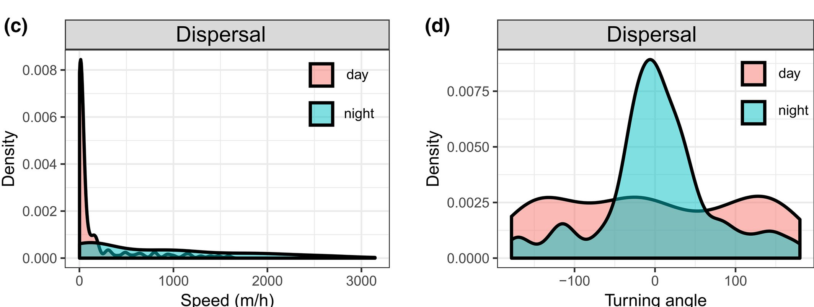

```{r setup, include=FALSE}
library(tidyverse)
knitr::opts_knit$set(root.dir = here::here("04 Behavioral states"))
knitr::opts_chunk$set(
  echo = TRUE, warning = FALSE, message = FALSE, 
  fig.height = 4, fig.width = 6, cache = FALSE, out.width = "85%", res = 600,
  comment = "", fig.align = "center")
options(width = 70, str = strOptions(strict.width = "wrap"))
theme_set(theme_light()) 
```

# Characterizing animal movement

- In order to use statistical models to describe the movement process. 
- This is most easily done using statistical distributions for step lengths and turn angles. 

# Distributions in statistics

- Random variables, are variables where each outcome has a probability and these probabilities are often mathematically summarized with functions that are characterized with one or more parameters (=**distributions**). 
- A distribution translates the a possible outcome in a probability, given some parameters.


---

For example, a normal distribution is characterized by the $\mu$ (mean) and $\sigma$ (standard deviation). If we know $\mu$ and $\sigma$ we can plot the distribution

```{r, out.width="60%"}
curve(dnorm(x, mean = 10, sd = 2), from = 5, to = 15)
```

Note, `dnorm()` is a built-in function for the normal density function.

---

- The normal distribution is very widely used in statistics, however, it is not useful to characterize step lengths and turn angles of animals, because values can range from $-\infty$ to $\infty$.

- For step lengths we need a distribution with a support of positive angles. 
- For turn angles we need a wrapped distribution. 

-------

## Distributions for step lengths

- Suitable distribution for step lengths: Gamma, Exponential, Half Normal, Weibull and possibly others. 
- We will use the Gamma distribution.
- The Gamma distribution has two parameters: shape and scale.

---

```{r, echo = FALSE, out.width="100%"}
xs <- seq(0.5, 200, 0.5)
params <- expand_grid(shape = c(2, 5, 10, 15, 20), scale = c(2, 5, 8))
params %>% mutate(
  data = map2(shape, scale, ~
                tibble(
                  x = xs, 
                  pdf = dgamma(xs, shape = .x, scale = .y)))) %>% 
  unnest(cols = data) %>% 
  mutate(
    scale_lab = paste0("scale = ", scale),
    shape_lab = factor(shape)
    ) %>% 
  ggplot(aes(x, pdf, col = shape_lab)) + 
  geom_line() + 
  facet_grid(. ~ scale_lab, scale = "free") +
  theme(legend.position = "bottom") + 
  labs(x = "step length", col = "shape", col = "shape")
```

-------

## Distributions for turn angles

- For turn angles we need a wrapped distribution. 
- A typical distributions are the von Mieses or the wrapped Cauchy distribution. 

-------

## Parameters may change

- Parameters for step-length distribution and turn-angle distribution can change, resembling different behavioral states of the animal (e.g., foraging vs. resting). 


```{r, echo = FALSE, fig.cap="Figure from Moll et al. 2021"}

```

# Take-home messages

1. We can use statistical distributions to characterize the movement of animals.
2. Statistical distributions are described using one or more parameters. 
3. Different behavioral states of the animal can be described with different parameter sets.


# Decoding states

- In most situation it is not possible to observe the animal continuously and directly refer to different states. 
- Many statistical and machine learning approach exist, that attempt to refer different behavioral states of the animal from location data (see e.g., Edelhoff et al. 2016 for a review).
- We will have a look at Hidden Markov Models to decode states. 


# Hidden Markov Models

## The idea

- In the simplest case we have one time series (for example a sequence of step lengths). 
- The observed step lengths originate from two (possibly more) step-length distributions and each step-length distribution resembles a different behavioral state. 
- The challenge that we face is to assigning observations to different step-length distributions. 

-----

## The mathematical model

- We start series of observation $\mathbf{Z}_1, \dots, \mathbf{Z}_T$ and underlying state Sequence $S_1, \dots, S_T$. For a total of $T$ observations.
- $S_T$ takes values from $1, \dots, N$. For a total of $N$ (behavioral) states. 
- $\mathbf{Z}_t$ is assumed to be drawn from $N$. 

```{r, fig.cap="Source: Michelot et al. 2016", echo = FALSE}

```

----

- Animal movement data usually consists of locations $(x_1, y_1), \dots, (x_T, y_T)$, from which different movement metrics can be calculated (usually step length $l_t$ and turn angle $\phi_t$). 
- Thus the observation process is: $\mathbf{z}_t = (l_t, \phi_t)$. 

----

## Transition between states

The transition between states is described by a matrix $\Gamma^{(t)}$. For a two-state HMM is this

$$
\Gamma^{(t)} = 
\left[ {\begin{array}{cc}
    \gamma_{1,1}^{(t)} & \gamma_{1,2}^{(t)} \\
    \gamma_{2,1}^{(t)} & \gamma_{2,2}^{(t)} \\
  \end{array} } \right]
$$

- $\gamma_{1,1}^{(t)}$ and $\gamma_{2,2}^{(t)}$ are the probabilities to remain in the first or second state, respectively.
- $\gamma_{1,2}^{(t)}$ is the probability to change from state one to stat two. 
- $\gamma_{2,1}^{(t)}$ is the probability to change from state one to stat two. 
- *Note, the row sums must be 1.*


-----

Transitions can depend on time-varying (spatial) covariates

$$
\gamma_{i,j}^{(t)} = \frac{\exp(\eta_{i,j}^{(t)})}{\sum_{k = 1}^N \exp(\eta_{i,k}^{(t)})}
$$

where

$$
\eta_{i,j}^{(t)} = 
 \left\{
\begin{array}{ll}
\beta_0^{(ij) + \sum_{l = 1}^p \beta_l^{(ij)} \omega_l^{(t)}} & \textrm{if }i \neq j;  \\
0 & \, \textrm{otherwise} \\
\end{array}
\right. 
$$

- Where $\omega_l$ is the $l$-covariate value and $p$ the number of covariates. 
- Maximum-likelihood estimation can be used to estimate coefficients.

----

What an HMM models is a set of parameters for the step-length distribution and the turn-angle distribution for each state.

# Take-home messages

1. Behavioral states are difficult (if not impossible) to observe.
2. Hidden Markov Models model an observed time series. 
3. Transition between states can depend on environmental covariates.

# Your turn

A three HMM has the following three sates: foraging, resting and travelling.

The probability of remaining in state 1 is 0.9, the probability to transition from state 1 to state 2 is 0.05. What is the probability to stay in state 2?

1. 0.05
2. 0.1
3. It's impossible to say without further information

----------

# How to choose starting values

```{r, echo = FALSE, fig.cap="Figure source: https://cran.r-project.org/web/packages/moveHMM/vignettes/moveHMM-starting-values.pdf"}

```

HMM use a non linear optimization and is sensitive to different starting values. In order to ensure that you found a global maximum of the likelihood, you need to try different starting values. 

# Choosing the correct number of states

- It is often difficult to determine the correct number of states. 
- Use a mix of statistical tools, biological knowledge and data that is available. 
- Pohle et al. 2017 did extensive simulations suggested a number of steps: https://link.springer.com/article/10.1007/s13253-017-0283-8#Sec11. 


# Assessing model fit

- Pseudo residuals can be calculated for HMMs. If the models fits the data well, these residuals should approximately follow a normal distribution. 
- This can be checked using qqplots. 
- Restrict residual checking to step lengths. For turn angles this not straight forward due to their circularity. 


# An example

Farhadinia *et al.* 2020^[https://link.springer.com/article/10.1186/s40462-020-0195-z] used HMMs to analyse movement data of Persian leopards.

```{r, echo = FALSE, out.width="90%", fig.align="center"}

```

-----

Step-length distributions and turn angle distribution in different behavioral states:

```{r, echo = FALSE, out.width="90%", fig.align="center"}

```

- State 1: Slow and undirected movement
- State 2: Moderately fast and directed movement
- State 3: Fast and directed movement

-----

The transitions between states can be modeled as a function of covariates.

```{r, echo = FALSE, out.width="90%", fig.align="center"}

```


## Take-home messages

-----


# Key resources/publications

\footnotesize

- Edelhoff, H., Signer, J., & Balkenhol, N. (2016). Path segmentation for beginners: an overview of current methods for detecting changes in animal movement patterns. Movement ecology, 4(1), 1-21.
- Langrock et al. 2012: Flexible and practical modeling of animal telemetry data: hidden Markov models and extensions. https://esajournals.onlinelibrary.wiley.com/doi/full/10.1890/11-2241.1
- Michelot et al. 2016: moveHMM: an R package for the statistical modelling of animal movement data using hidden Markov models. https://doi.org/10.1111/2041-210X.12578
- Pohle et al. 2017: Selecting the Number of States in Hidden Markov Models: Pragmatic Solutions Illustrated Using Animal Movement. https://link.springer.com/article/10.1007/s13253-017-0283-8