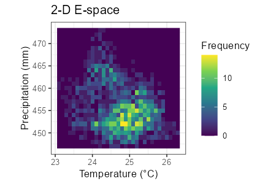
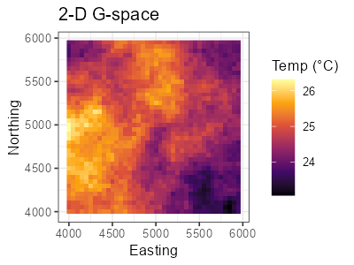
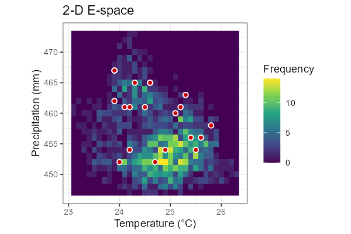
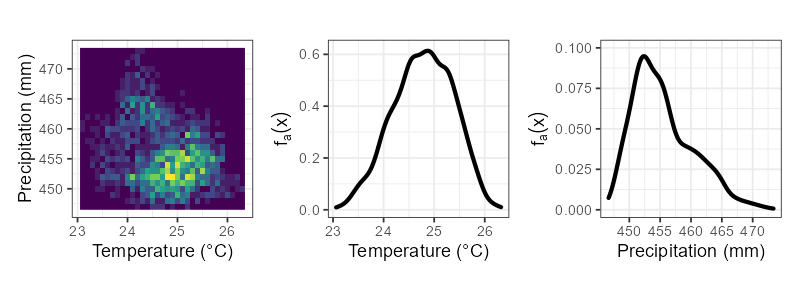
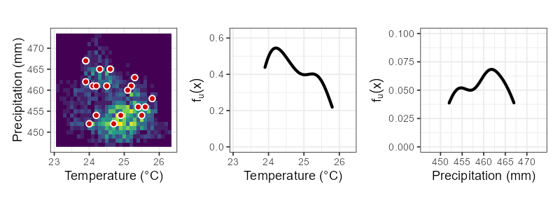
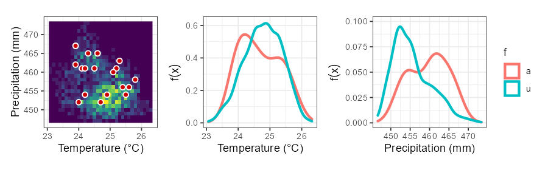
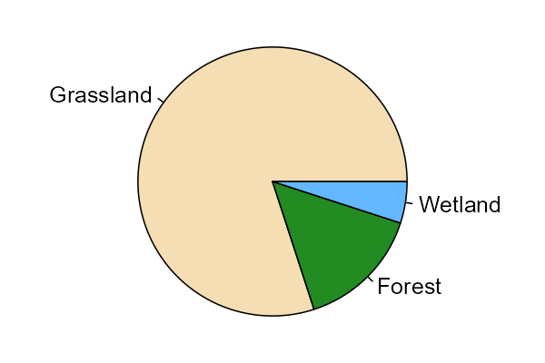

```{r setup, include=FALSE}
options(htmltools.dir.version = FALSE)
library(RefManageR)
BibOptions(check.entries = FALSE, bib.style = "authoryear", style = "markdown",
           dashed = TRUE)
bib <- ReadBib(here::here("05 HSF", "05_refs.bib"))
```

class: center, middle, inverse

# Introduction to Habitat Selection
## Habitat Selection Functions

Brian J. Smith  
26 January 2022

*Analysis of Animal Movement Data in R*  
J. Signer & B. Smith  

---

class: center, middle

# What is habitat selection?

---
name: terms

## Terminology

---
template: terms

- Environmental Space vs. Geographic Space
- Habitat
- Availability
- Use
- Selection

<br>
<div style = "color:#909090; font-size:80%; font-style:italic;">

We will primarily use the terminology and notation of Matthiopoulos et al. (2020). 

<br><br>

Note that Lele et al. (2013) is another good source for this information, with similar definitions.

</div>

---
template: terms

.pull-left[
### Environmental space

- E-space
- The space defined by environmental variables, *e.g.*, temperature and precipitation.


]

.pull-right[
### Geographic space

- G-space
- The space defined by physical dimensions, *e.g.*, easting and northing or longitude and latitude.


]

---
template: terms

- Habitat
  - A point in **E-space** defined by a set of resources, risks, and conditions.
 
.center[  

]

---
template: terms

- Availability
  - The distribution of habitats that *could have* been used by an animal during a study period.

We will denote as $f_a(x)$, where $x$ is a point in E-space.

.center[  ]

---
template: terms

- Use
  - The distribution of habitats (observed to be) used by an animal during a study period.

We will denote as $f_u(x)$, where $x$ is a point in E-space.

.center[  ]

---
template: terms

- Selection
  - The process by which an organism uses a habitat disproportionately (more or less) compared to that habitat's availability.

We will denote as $w(x)$, where $x$ is a point in E-space.
  
.center[  ]
  
---
template: terms

- Selection = Use vs. availability, *i.e.*, $w(x) \propto \frac{f_u(x)}{f_a(x)}$.
  - $w(x) > 1 \Rightarrow$ positive selection
  - $w(x) = 1 \Rightarrow$ no selection (used in proportion to availability)
  - $w(x) < 1 \Rightarrow$ negative selection (avoidance)
  
- Most common form for $w(x)$ is an exponential function w/o intercept

$$w(x) = exp[\beta_1 h_1(x) + \beta_2 h_2(x) + ... ]$$

???

Note that $w(x)$ is merely proportional to the ratio of used:available. However, in the simple example where $f_u(x)$ and $f_a(x)$ are already normalized proportions (sum to 1), then the constant of proportionality is 1.

In that case $w(x) = 1$ indicates no selection as written on the slide.

---
class: inverse

## Take-home messages

- Habitats are any point we measure in E-space.

- Habitat selection is the process by which habitat use is disproportionate (higher or lower) to habitat availability.

- The most common form of $w(x)$ in the literature is known as the exponential habitat selection function.

---
class: center, middle
# Scales of Habitat Selection

---

## Scales of habitat selection

- Habitat selection is use vs. availability.

  - The data we collect are samples of use.
  
  - Our inference depends on our definition of availability.
  
- How we define availability depends on the scale of inference we desire.
  
---

## Scales of habitat selection

Johnson (1980) defined four hierarchical scales of habitat selection.

1. First-order selection: where the species range occurs on Earth (species distribution models).

2. Second-order selection: where the home range of an individual is placed within the species range.

3. Third-order selection: which components, *e.g.*, feeding sites, are used within an individual's home range.

4. Fourth-order selection: which actual features are used at a specific site, e.g., specific food items from a feeding site (microhabitat selection).

---

### First order: species distribution/population range

.center[
<a href="https://en.wikipedia.org/wiki/Species_distribution" target="_blank" rel="noopener noreferrer"></a>
]

---

### Second order: home range within population range

.center[
<a href="https://doi.org/10.1890/11-1610.1" target="_blank" rel="noopener noreferrer"></a>
]

.note[ Fig. 1 from DeCesare et al. (2012) ]

---

### Third order: used locations within home range

.center[

]

---

### Fourth order: individual resources

.center[
<a href="https://en.wikipedia.org/wiki/Foraging#Genetics" target="_blank" rel="noopener noreferrer"></a>
]

---

## Scales of habitat selection

What do we typically define as available for each scale?

1. First-order selection: all habitats on the globe or continent

2. Second-order selection: all habitats within the species' distribution or the entire study area.

3. Third-order selection: all habitats within a fitted home range (*e.g.*, within a 100% MCP).

4. Fourth-order selection: not usually done with location data, often comparing particular diet items or refuge types.

---

## Scales of habitat selection

What do we typically define as available for each scale?

.center[
*Availability is defined subjectively to answer a particular question.*

*These scales are useful guides, but make the right choice to answer your question.*

]

---
class: inverse

## Take-home messages

- Defining availability for the purposes of measuring habitat selection is crucial.

- Careful consideration of the scale of habitat selection can help guide the definition of availability.

- Choose the right availability to answer your question.

---
class: center, middle
# Simple Habitat Selection Example

---
## Simple example

Say that you've been tracking an individual animal, and this is the breakdown of the percentage of relocations you have in each habitat.

.center[
  
]

---

## Simple example

| Habitat Type \\(x\\) | Used \\(f_u(x)\\) | Available \\(f_a(x)\\) |
|:--------------------:|:-----------------:|:----------------------:|
| Grassland            | 80%               |                        |
| Forest               | 15%               |                        |
| Wetland              | 5%                |                        |

.center[
Which habitat is most important to our study animal? 

How much do they "like" it?
]

---

## Simple example

| Habitat Type \\(x\\) | Used \\(f_u(x)\\) | Available \\(f_a(x)\\) |
|:--------------------:|:-----------------:|:----------------------:|
| Grassland            | 80%               | 90%                    |
| Forest               | 15%               | 5%                     |
| Wetland              | 5%                | 5%                     |


.center[
Which habitat is most important to our study animal? 

How much do they "like" it?

Did your answer change?
]

---

## Simple example

| \\(x\\)   | \\(f_u(x)\\) | \\(f_a(x)\\) | \\(w(x)\\) |
|:---------:|:------------:|:------------:|:----------:|
| Grassland | 80%          | 90%          |.red[0.889] |
| Forest    | 15%          | 5%           |.grn[3.000] |
| Wetland   | 5%           | 5%           | 1.000      |

- $w(x) > 1 \Rightarrow$ .grn[positive selection]
- $w(x) = 1 \Rightarrow$ no selection (used in proportion to availability)
- $w(x) < 1 \Rightarrow$ .red[negative selection (avoidance)]


???

Recall that these rules for $w(x)$ hold because the constant of proportionality in this case is 1.
---

## Simple example

| \\(x\\)   | \\(f_u(x)\\) | \\(f_a(x)\\) | \\(w(x)\\) | \\(log[w(x)]\\) |
|:---------:|:------------:|:------------:|:----------:|:---------------:|
| Grassland | 80%          | 90%          |.red[0.889] | .red[-0.118]    |
| Forest    | 15%          | 5%           |.grn[3.000] | .grn[ 1.099]    |
| Wetland   | 5%           | 5%           |     1.000  |       0.000     |

.center[
log-transforming $w(x)$ makes selection correspond to $-/0/+$:
]

  - $log[w(x)] > 0 \Rightarrow$ .grn[positive selection]
  - $log[w(x)] = 0 \Rightarrow$ no selection (used in proportion to availability)
  - $log[w(x)] < 0 \Rightarrow$ .red[negative selection (avoidance)]

---
class: center, middle

**How can we generalize to more complex environmental space?**

---
class: center, middle, inverse


---

class: center, middle

# Inhomogeneous Poisson Point Process

---

## What is an inhomogeneous Poisson point process?

- A model for events in geographic space where the expected **density** of points depends on local spatial predictors through a spatially varying intensity function.

.center[
We will denote the intensity function at location $s$ in **geographic space** as $\lambda(s)$.]

- The number of events in any given region is assumed to be Poisson distributed, with mean (and variance) given by the average intensity function over the region.

- Abbreviated IPP (Inhomogeneous Point Process).

---

## What is an inhomogeneous Poisson point process?

- Many common space-use models have been shown to be equivalent to the IPP (reviewed in Fieberg et al. 2021).
  - MaxEnt
  - Weighted distribution theory (with an exponential form)
  - Resource utilization functions (RUFs)
  - .grn[Resource selection functions (RSFs), a.k.a. habitat selection functions (**HSFs**)]
  
---
class: inverse

## Take-home messages

- The IPP model underlies many common space-use models, including HSFs.

- The IPP models point *density*.

---
class: center, middle

# Habitat Selection Functions
*Fitting IPP Models to Telemetry Data*

---

## Habitat Selection Functions (HSFs)

Using the IPP framework, we can model the intensity function in space, $\lambda(s)$ as a function of $k$ environmental predictors (the habitat axes):

$$log[\lambda(s)] = \beta_0 + \beta_1 h_1(s) + ... + \beta_k h_k(s)$$

$$\Rightarrow$$

$$\lambda(s) = exp[\beta_0 + \beta_1 h_1(s) + ... + \beta_k h_k(s)]$$

---

## Habitat Selection Functions (HSFs)

The intensity in geographic space, $\lambda(s)$, is proportional to the habitat selection function in environmental space, $w(x)$ (Matthiopoulos et al. 2020).

$$\lambda(s) \propto w(x(s))$$

where $x(s)$ is the value of the habitat dimensions (the E-space coordinates) at the location $s$ in G-space.

*Note this implies $w(x)$ is an exponential function, too.*

*Also note that the transition from E-space to G-space can lead to nonsensical predictions. We will return to this point later in the workshop.*

---

## Habitat Selection Functions (HSFs)

The spatial events we are focused on modeling here are telemetry relocations.
- Absolute density of points depends on frequency and duration of telemetry
  - *i.e.*, it is not of biological interest.
  - This implies that $\beta_0$ is not of biological interest.
  
---

## How do we fit an HSF?

If we are working in discrete space, we can count the number of relocations in a grid cell and model the count using a Poisson GLM.

$$log[\lambda(s)] = \beta_0 + \sum_{j=1}^k \beta_j h_j(s)$$

$$y(s) \sim Poisson\left(\lambda(s)\right)$$

(Note that the area of a pixel should be included as an offset -- explained in Fieberg et al. 2021).

---

## How do we fit an HSF?

If we are working in continuous space, we can randomly sample available locations, code our used locations as 1 and our available locations as 0, and then use a binomial GLM (*i.e.*, logistic regression).

$$logit[\lambda(s)] = log\left[\frac{\lambda(s)}{1 - \lambda(s)}\right] = \beta_0 + \sum_{j=1}^k \beta_j h_j(s)$$

$$y(s) \sim Binomial\left(N = 1, p = \lambda(s)\right)$$

This is the most common approach for fitting HSFs.

---

## Note the similarity

### Poisson

$$log[\lambda(s)] = \beta_0 + \sum_{j=1}^k \beta_j h_j(s)$$


### Binomial

$$logit[\lambda(s)] = log\left[\frac{\lambda(s)}{1 - \lambda(s)}\right] = \beta_0 + \sum_{j=1}^k \beta_j h_j(s)$$

---

## Poisson vs. Binomial

$$0 < \lambda(s) << 1$$ 
$$\Rightarrow$$ 
$$\log[\lambda(s)] \approx log\left[\frac{\lambda(s)}{1 - \lambda(s)}\right]$$


---

## Poisson vs. Binomial 
  
Also note that the Poisson is a limiting case of the Binomial distribution when $N$ gets very large and $p$ gets very small.

---

## What does this mean for fitting HSFs?

Our binomial GLM is only a good approximation for the IPP model when the number of available locations gets *large* $(\rightarrow \infty)$, which implies:
- $E[logit(\lambda(s))] \rightarrow 0$
- Binomial $\rightarrow$ Poisson

---

## What does this mean for fitting HSFs?

We already mentioned that the intercept of the IPP from telemetry data is not of biological interest.

The intercept of the logistic regression is related to the ratio of 0s and 1s and so is furthermore not the intercept of the IPP.

However, the other $\beta$ parameters converge to the slopes of the IPP model as the number of available points tends to infinity (Warton and Shepherd 2010). 

Further, assigning "infinite weights" to available points ensures this equivalence with the IPP (Fithian and Hastie 2013).

---

## Important assumptions

- Standard assumptions of GLMs apply!

- *E.g.*, the independence assumption, *i.e.*, any clustering in space is explained by covariates.
  - Doesn't mean no autocorrelation in raw data!
  - Autocorrelation must be due to habitat autocorrelation.
  - Should be no *residual* autocorrelation.

---
class: inverse
## Take-home messages

- The HSF models density of points (telemetry locations) as a function of habitat.

- We use logistic regression to fit the HSF.
  - The number of available points should be large.
  - The available points should be given large weights.
  
- The resulting intercept is not of interest (so ignore it), but the slopes measure habitat selection.

---

class: center, middle

# Relative Selection Strength
Effect Sizes from Habitat Selection Models

---

class: center, middle

## How do we interpret our fitted HSF?

---

## How do we interpret our fitted HSF?

We've fitted our HSF, so we now have estimates for each of the $\beta$ coefficients. If we multiply each coefficient by the value of each habitat variable and add them all up, we get the linear predictor, $g(x)$. Note that we have dropped $\beta_0$.

$$g(x) = \sum_{j=1}^k \beta_j h_j(x)$$

We have estimates for the $\beta$s and the $h$s are data, so we can plug those in and get a value for any $g(x)$.

---

## How do we interpret our fitted HSF?

Our habitat selection function, $w(x)$, takes the exponential form in this case.

$$w(x) = exp(g(x))$$

And we know that our intensity of use (in space) is proportional to $w(x)$

$$\lambda(s) \propto w(x(s))$$

**So $w(x)$ is proportional to expected density in that habitat**.

---

## How do we interpret our fitted HSF?

What does $w(x)$ tell us biologically?

It is proportional to (expected) density by some unknown **constant**, $c$.

Let's see what happens if we take the *ratio* of **densities** in two habitats:

$$\frac{c \times w(x_1)}{c \times w(x_2)}$$

--

$$\require{cancel} \frac{\cancel{c \times} w(x_1)}{\cancel{c \times} w(x_2)}$$

---

## Relative Selection Strength (RSS)

Avgar et al. (2017) called this ratio "Relative Selection Strength" (RSS).

$$RSS(x_1, x_2) = \frac{w(x_1)}{w(x_2)}$$


.center[
**"how many times more points we expect in habitat $x_1$ than in habitat $x_2$** *if they were equally available."*
]


---

## log-RSS

Avgar et al. (2017) also suggested using log-RSS, since $w(x)$ is an exponential function. With a bit of algebra, we can see:

$$log[RSS(x_1, x_2)] = log\left[\frac{w(x_1)}{w(x_2)}\right]$$

$$ = log[w(x_1)] - log[w(x_2)]$$

$$ = g(x_1) - g(x_2) $$

So log-RSS is just the difference in the linear predictors for the two habitats.

---

## log-RSS

Avgar et al. (2017) also showed that the fitted $\beta$s *are* the log-RSS for a one-unit change in that habitat. 

---

## log-RSS

Avgar et al. (2017) also showed that the fitted $\beta$s *are* the log-RSS for a one-unit change in that habitat. We can see this in an example with 2 habitat axes. *I.e.*,

$$g(x) = \beta_1 h_1(x) + \beta_2 h_2(x)$$

Let's calculate $log[RSS(x_1, x_2)]$ where the only difference is 1-unit in the first habitat.

$$log[RSS(x_1, x_2)] = g(x_1) - g(x_2)$$

$$ = [\beta_1 h_1(x_1) + \beta_2 h_2(x_1)] - [\beta_1 h_1(x_2) + \beta_2 h_2(x_2)]$$

$$ = \beta_1[h_1(x_1) - h_1(x_2)] + \beta_2[h_2(x_1) - h_2(x_2)]$$ 

---

## log-RSS

Now plug-in 

$$[h_1(x_1) - h_1(x_2)] = 1$$ 

.center[and] 

$$[h_2(x_1) - h_2(x_2)] = 0$$

<br>

$$ \beta_1[h_1(x_1) - h_1(x_2)] + \beta_2[h_2(x_1) - h_2(x_2)]$$ 

$$ = \beta_1[1] + \beta_2[0]$$

$$ = \beta_1$$

---

## log-RSS

Note that any dimensions along which the habitats are the same have no effect on log-RSS (unless there are interactions in the model, more on that in a future lecture).

Note also that this gives us a way to intuitively think of each individual $\beta$ (again, in models without interactions).

---
class: inverse
## Take-home messages

- RSS is the most intuitive way to interpret an HSF.
  - "How many times more points we expect in $x_1$ vs. $x_2$."
  
- log-RSS is easier to calculate.
  - It's just the difference in the linear predictor for $x_1$ vs. $x_2$.
  
- The raw $\beta$s themselves are the log-RSS for a one-unit change in that habitat dimension.

---
class: center, middle

# Questions?

---

class: small-font

# References


```{r, results='asis', echo=FALSE}
NoCite(bib)
PrintBibliography(bib, .opts = 
                    list(no.print.fields = c("issn", "url")))
```


<br>

.note[ See also Fieberg et al. 2021 [Appendix A](https://conservancy.umn.edu/bitstream/handle/11299/218272/AppA_HSF_examples.html) for coded HSF examples. ]