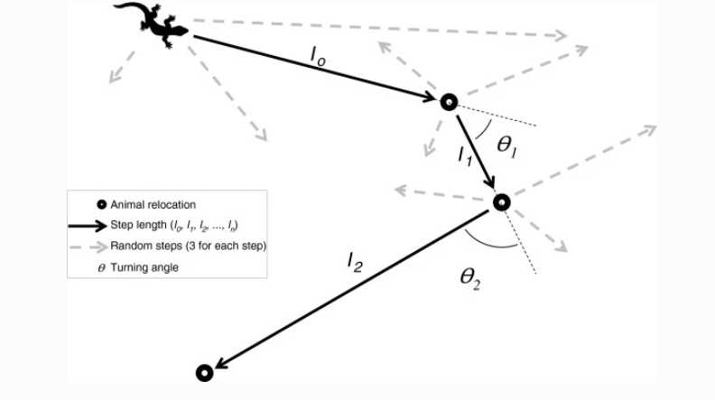

```{r setup, include=FALSE}
library(tidyverse)
library(here)
knitr::opts_knit$set(root.dir = here::here("06 iSSF"))
knitr::opts_chunk$set(
  echo = TRUE, warning = FALSE, message = FALSE, 
  fig.height = 4, fig.width = 6, cache = FALSE, out.width = "85%", res = 600,
  comment = "", fig.align = "center")
options(width = 70, str = strOptions(strict.width = "wrap"))
theme_set(theme_light()) 
```

# Availability matters

<<<<<<< HEAD
- Habitat-selection function assume that each point in the availability domain (e.g., the home range) is available to the animal at any given point in time. 
- This assumption might be met with relatively coarse data (large sampling rates), but the assumption becomes unrealistic for data sets with a higher temporal resolution. 

- In addition SSFs model account for serial autocorrelation.
=======
- HSF (in particular RSFs) assume that each point in the availability domain (e.g., the home range) is available to the animal at any given point in time. 
- This assumption might be met with relatively coarse data (large sampling rates), but the assumption becomes unrealistic for data sets with a higher temporal resolution. 

>>>>>>> c8cace125a3405d52965ef48438bccb6a7972990

# Step-selection function (SSF)

Fortin et al. (2005) introduced the step-selection function: 

$$
u(s,t+\Delta t) | u(s', t) = \frac{w(X(s); \beta(\Delta t))}{\int_{\tilde{s}\in G}w(X(\tilde{s}, s'); \beta(\Delta t))d\tilde{s}} 
$$
 
- $u(s, t+\Delta t) | u(s', t)$ is conditional probability of finding the individual at location $s$ at time $t+\Delta t$ given it was at location $s'$ at time $t$.        

- $w(X(s); \beta(\Delta t))$ is the exponential selection function, which again is $w(X(s); \beta(\Delta t)) = \exp(\beta_1 x_1(s) + \dots + \beta_kx_k(s))$. 

- The denominator is the full redistribution kernel that is usually approximated through random steps. 

----

We can estimate the $\beta$'s using maximum likelihood with the following likelihood function

$$
L(\beta |s_1, \dots, s_t, \dots, s_T) = \prod_{t = 1}^T \frac{\exp(\beta X(s_t, t))}{\sum_{i = 1}^n\exp(\beta X(s_{t,i}, t))}
$$

$\beta$'s can be estimated with the R function `clogit()` from the `survival` package. 

The `amt` package provides a wrapper to this called `fit_ssf()`. 

--- 

## Creating random steps for SSF

We will cover this in much more detail in the R walkthrough. The workflow to fit an SSF in most cases follows the same set of steps: 

1. Make sure the data are in bursts of regular sampling rates (Note, the $\Delta t$ in the equation). 
2. Create steps (that is converting two consecutive points to a step with a start and end point). 

-----

```{r, echo=FALSE, fig.cap="From Thurfjell et al. 2014"}

```

-----

3. Sample for each observed step $k$ random steps using the distribution from the observed steps and turn angles.

4. Extract covariates at the *end* of steps, and

5. Fit a conditional logistic regression.

----

- Interpretation of parameters can be done exactly the same way as for HSF (previous module). 
- The relative selection strength (RSS) is how many times more probable it is to select one step over an other step, when the two steps differ in one covariate in at the end of the step.

------

We fitted a simple model to one deer: `fit_ssf(case_ ~ forest + strata(step_id_))`

```{r, echo = FALSE}
set.seed(123)
library(amt)
library(broom)
data(deer)
data("sh_forest")
forest <- sh_forest == 1
names(forest) <- "forest"

m1 <- deer %>% steps_by_burst() %>% random_steps() %>% 
  extract_covariates(forest) %>% 
  fit_ssf(case_ ~ forest + strata(step_id_))
tidy(m1$model)
```

- `forest` indicates if the end of a step is located inside a forest or not.
- $\exp(\beta_1) = \exp(0.488) = 1.63$. This indicates that it is 1.63 times more probably for a step to end in a forest patch than in a non-forest patch. 


# Take-home points

- The availability is usually constraint SSFs allow to model this. 
- Each observed step is paired with random $k$ steps. 
- An observed step and $k$ random steps form a strata.
- We can use conditional logistic regression to estimate the selection coefficients

# The integrated Step-Selection Function (iSSF)

- Forester et al. 2009 suggested to include the step length as an additional covariate to account for the bias that is introduced, because we are sampling from the observed steps. These steps are not independent of habitat selection. 
- Avgar et al. 2016 coined the term **integrated** SSF and showed how commonly used statistical distributions can be used to model the selection-free movement kernel. 

- This adds a further term to the equation we saw before: 


$$
u(s,t+\Delta t) | u(s', t) = \frac{w(X(s); \beta(\Delta t))\phi(s, s'; \gamma(\Delta t))}{\int_{\tilde{s}\in G}w(X(\tilde{s}, s'); \beta(\Delta t))\phi(\tilde{s},s'; \gamma(\Delta t))d\tilde{s}} 
$$
 
- $\phi(s,s'; \gamma(\Delta t))$ is a selection-independent movement kernel that describes how the animal would move in homogeneous habitat.

-----

We can estimate the selection coefficients ($\beta$'s) and movement related coefficients (here denoted as $\gamma$'s) using a conditional logistic regression. 


$$
L(\beta |s_1, \dots, s_t, \dots, s_T) = \prod_{t = 1}^T \frac{\exp(\beta X(s_t, t) + \gamma(s_t, s_{t-1}))}
{\sum_{i = 1}^n\exp(\beta X(s_{t,i}, t) + \gamma(s_{t,i}, s_{t-1}))}
$$

----

Remember how we can characterize movement in discrete time:

```{r, echo=FALSE, fig.cap="From Thurfjell et al. 2014"}

```

----

- Before we sampled random steps from the observed step lengths and turn angles. 
- We replace this step by using statistical distributions (most often Gamma distribution for step lengths and von Mises distribution for turn angles). 


----

## Creating random steps for iSSFs

We will cover this in much more detail in the R walkthrough. The workflow is usually as follows: 

1. Make sure the data are in bursts of regular sampling rates (Note, the $\Delta t$ in the equation). 
2. Create steps (that is converting two consecutive points to a step with a start and end point). 
3. ~~Sample for each observed step $k$ random steps using the distribution from the observed steps and turn angles.~~
3. Sample for each observed step $k$ random steps **using a statistical distribution fit to the observed steps or turn angles**.
4. Extract covariates at the *end* of steps, and
5. Fit a conditional logistic regression.

----

## How to include movement?

- Including the habitat independent movement kernel in the model is possible through functions for the step length and turn angles^[see here for details: https://conservancy.umn.edu/bitstream/handle/11299/218272/AppC_iSSA_movement.html].

- For the Gamma distribution the coefficients of the 
  - step length is linked to the scale parameter, and 
  - the log of the step length is linked to the shape parameter. 

- For the von Mises distribution the cosine of the turn angle is linked to the concentration parameter. 

Once the model is fitted to the data, the tentative parameter estimates can be adjusted (more on this in module 7). 

----

## How many random steps do we need?

- There is no rule of thumb, generally the more random steps the better. 
- Typical number of random steps range from 10 to 100. 
- An easy way to check if the number of random steps is sufficient, is to rerun the analysis several times with increasing an increasing number of random steps and check when estimates stabilize. 


--- 


# Take-home points

- SSF can be extended by including movement (**iSSF**). 
- We sample step length and turn angles from fitted statistical distributions. 
- We then include functions of steps in the model. 


# Key resources/publications

\footnotesize

- Avgar, T., Potts, J. R., Lewis, M. A., & Boyce, M. S. (2016). Integrated step selection analysis: bridging the gap between resource selection and animal movement. Methods in Ecology and Evolution, 7(5), 619-630.
- Fortin, D., Beyer, H. L., Boyce, M. S., Smith, D. W., Duchesne, T., & Mao, J. S. (2005). Wolves influence elk movements: behavior shapes a trophic cascade in Yellowstone National Park. Ecology, 86(5), 1320-1330.
- Forester, J. D., Im, H. K., & Rathouz, P. J. (2009). Accounting for animal movement in estimation of resource selection functions: sampling and data analysis. Ecology, 90(12), 3554-3565.
- Signer, J., Fieberg, J., & Avgar, T. (2019). Animal movement tools (amt): R package for managing tracking data and conducting habitat selection analyses. Ecology and evolution, 9(2), 880-890.
- Thurfjell, H., Ciuti, S., & Boyce, M. S. (2014). Applications of step-selection functions in ecology and conservation. Movement ecology, 2(1), 1-12.