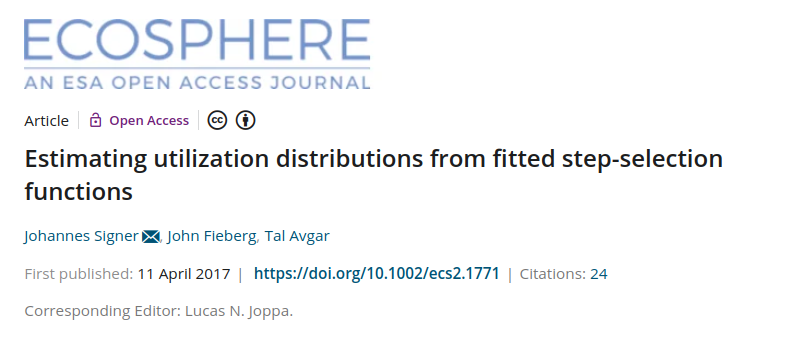
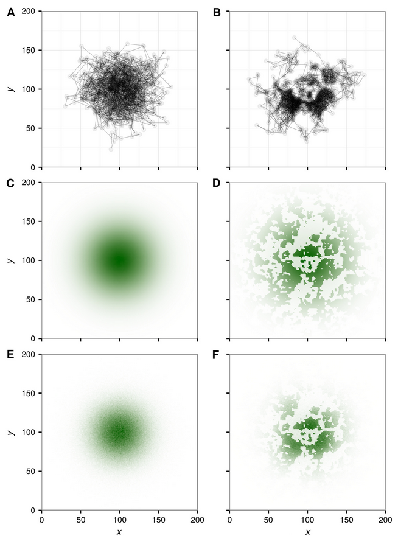
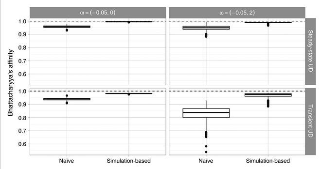
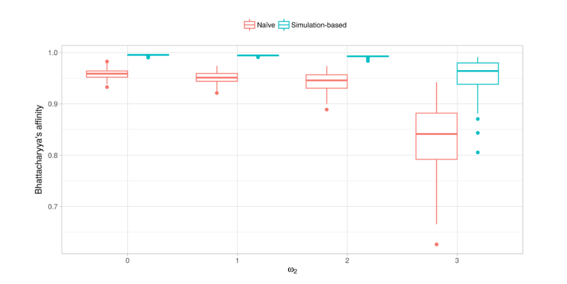
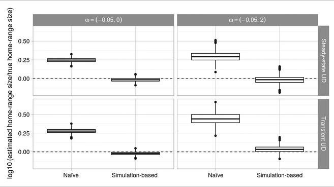

```{r setup, include=FALSE}
library(tidyverse)
library(here)
knitr::opts_knit$set(root.dir = here::here("07 Simulation"))
knitr::opts_chunk$set(
  echo = TRUE, warning = FALSE, message = FALSE, 
  fig.height = 4, fig.width = 6, cache = FALSE, out.width = "85%", res = 600,
  comment = "", fig.align = "center")
options(width = 70, str = strOptions(strict.width = "wrap"))
theme_set(theme_light()) 
```

# Why to simulate?

- Predict space use of animals in novel habitats. 
- Predicting where will the animal be in the future. 
- Create maps of the long-term space use in a given area. 
- How will an "average" animal behave?

------

Studies that asses the connectivity between populations or patches often

1. Fit an HSF/SSF to telemetry data. 
2. Create a map of space use by multiplying coefficients with resources (we saw this yesterday). 
3. Invert these maps and use them as resistance to connectivity. 
4. Find corridors with other algorithms (e.g., least cost path, circuitscape, randomized shortest path). 

While this approach **might** be reasonable for HSF (RSF) analyses, it cant be used for (i)SSF, because it neglects the conditional formulation.

------

**2. Create a map of space use by multiplying coefficients with resources**

If we do this for iSSF, we introduce a **bias** because we are neglecting conditional formulation of iSSFs when creating maps.


```{r, echo = FALSE}

```

-----

- Simulations were used to compare two approaches:
    - naive
    - simulation-based

```{r, echo = FALSE, fig.cap="Source Signer et al. 2017", out.width="40%"}

```

# What do we predict?

We aim to predict a **Utilization Distribution** (UD). 
The UD is defined as: 

> The two-dimensional relative frequency distribution of space use of an animal (Van Winkle 1975)

We can distinguish between two different UDs:

1. Transient UD (TUD) is the expected space-use distribution over a short time period and is thus sensitive to the initial conditions (e.g., the starting point).
2. Steady state UD (SSUD) is the long-term (asymptotically infinite) expectation of the space-use distribution across the landscape.

-----

```{r, echo = FALSE, fig.cap="Source Signer et al. 2017"}

```

-----

The bias becomes even worse if selection is stronger:

```{r, echo = FALSE, fig.cap="Source Signer et al. 2017"}

```


-------

This bias propagates through derived quantities (e.g., home-range size)

```{r, echo = FALSE, fig.cap="Source Signer et al. 2017"}

```


# Take-home messages

- Simulation allow us to predict space-use in the long term, novel environment or other individuals. 
- For iSSA it is important to acknowledge the conditional formulation. 
- We can acknowledge the conditional formulation by using simulations.

# Predicting space use from HSF

From HSF we can only estimate a SSUD. This is done by using the following formula

$$
UD(s_j) = \frac{w(s_j)}{\sum_{j = 1}^G w(s_j)} = \frac{\exp(\sum_{i = 1}^n\beta_i x_i(s_j))}{\sum_{j = 1}^G \exp(\sum_{i = 1}^n\beta_i x_i(s_j))}
$$


The intercept ($\beta_0$) is **not** included. 


# iSSF

- For iSSF we have to use simulations (but see Potts and Schlägel 2020). 
- We can think of the iSSA as a simple individual based model with habitat selection and a selection-free movement kernel. We can rewrite

$$
u(s, t + \Delta t) | u(s', t) = \frac{w(X(s);\beta(\Delta t))\phi(s, s', \gamma(\Delta t))}{\int_{\tilde{s} \in G} w(X( \tilde{s}, s');\beta(\Delta t))\phi(\tilde{s}, s';\gamma(\Delta t))ds}
$$

as loglinear function. 

\pause

$$
u(s, t + \Delta t) | u(s', t) \propto \exp\bigg(\underbrace{\sum_{i = 1}^k \beta_ix_i(s)}_{=w(\cdot) \text{ selection}} + \underbrace{\sum_{j = 1}^l\gamma_j\theta_j(s, s')}_{=\phi(\cdot) \text{ movement}}\bigg)
$$

---

- The $\beta_i$'s for the selection kernel can be estimated. 
- The $\gamma_j$' for the selection-free movement kernel can be expressed as functions for step length and turn angle. Specifically for a Gamma step-length distribution and a von Mises turn-angel distribution they are given by: 

$$
\phi_i =\exp\left(\underbrace{(\beta_{\cos(\alpha)} + \nu_0 )}_{\gamma_{\cos(\alpha_i)}}\cos(\alpha_i) + \underbrace{(\beta_l - q_0^{-1})}_{\gamma_{l_i}}l_i + \underbrace{(\beta_{\ln(l_i)} + k_0 - 1)}_{\gamma_{\ln(l_i)}}\ln(l_i)\right).
$$

- With $\nu_0$ being the tentative concentration parameter of the von Mises distribution, and 
- $q_0$ and $k_0$ the tentative scale and shape parameter of a Gamma distribution for the step-lengths respectively.

---- 

# Dispersal kernels

A dispersal kernel consists of: 

- A selection-free movement kernel, that is characterized by a
  - turn-angle distribution (e.g. von Mises)
  - step-length distribution (e.g. Gamma)
- A movement-free selection kernel

Both kernels are included simulatenously in the integrated Step-Selection Function. 

# Some dispersal kernels 

We with this we can parameterize different dispersal kernels.

\only<1>{Parametrization: \texttt{\textasciitilde 1}}
\only<2>{Parametrization: \texttt{\textasciitilde sl\_ + log\_sl\_}}
\only<3>{Parametrization: \texttt{\textasciitilde cos\_}}
\only<4>{Parametrization: \texttt{\textasciitilde sl\_ + log\_sl\_ + cos\_ta\_}}
\only<5>{Habitat}
\only<6>{Parametrization: \texttt{\textasciitilde forest\_end}}
\only<7>{Parametrization: \texttt{\textasciitilde sl\_ + log\_sl\_ + cos\_ta\_ + forest\_end}}
\only<8>{Parametrization: \texttt{\textasciitilde sl\_ + log\_sl\_ + cos\_ta\_ + cos\_ta\_:forest\_start}}
\only<9>{Parametrization: \texttt{\textasciitilde sl\_ + log\_sl\_ + cos\_ta\_ + cos\_ta\_:forest\_start}}

\includegraphics<1>{img/fig1_panel2.pdf}
\includegraphics<2>{img/fig1_panel4.pdf}
\includegraphics<3>{img/fig1_panel5.pdf}
\includegraphics<4>{img/fig1_panel6.pdf}
\includegraphics<5>{img/fig1_panel1.pdf}
\includegraphics<6>{img/fig1_panel3.pdf}
\includegraphics<7>{img/fig1_panel7.pdf}
\includegraphics<8>{img/fig1_panel8.pdf}
\includegraphics<9>{img/fig1_panel9.pdf}

# How to get values for the movement kernel?

- Estimate an iSSF. 
- Then plugin the estimated coefficient together with their tentative estimates. 

$$
\phi_i =\exp\left(\underbrace{(\beta_{\cos(\alpha)} + \nu_0 )}_{\gamma_{\cos(\alpha_i)}}\cos(\alpha_i) + \underbrace{(\beta_l - q_0^{-1})}_{\gamma_{l_i}}l_i + \underbrace{(\beta_{\ln(l_i)} + k_0 - 1)}_{\gamma_{\ln(l_i)}}\ln(l_i)\right).
$$

# How-to do simulations?

- We can simulate a new path where the animal would have gone using series of dispersal kernels and then sampling from these kernels. Repeating this many times leads us to a transient UD.
- We can simulate for a very long time in order obtain the steady-state UD.
- Implementation for this not fully completed.

# What can be simulated in `amt`

## Static selection-free movement kernel

- Available in `amt` for SSUD and TUD

## Dynamic selection-free movement kernel

- Work in progress (hopefully not much longer)

# Take-home messages

1. We can estimate parameters for a selection-free movement kernel and movement-free selection kernel using iSSF.
2. Using the iSSF we can include both kernels in a loglinear form.
3. With this we can simulate how the space use might look in future or under novel conditions.

# Key resources/publications

\footnotesize

- Avgar, T., Potts, J. R., Lewis, M. A., & Boyce, M. S. (2016). Integrated step selection analysis: bridging the gap between resource selection and animal movement. Methods in Ecology and Evolution, 7(5), 619-630.
- Potts, J. R., & Schlägel, U. E. (2020). Parametrizing diffusion‐taxis equations from animal movement trajectories using step selection analysis. Methods in Ecology and Evolution, 11(9), 1092-1105.
- Signer, J., Fieberg, J., & Avgar, T. (2017). Estimating utilization distributions from fitted step‐selection functions. Ecosphere, 8(4), e01771.
