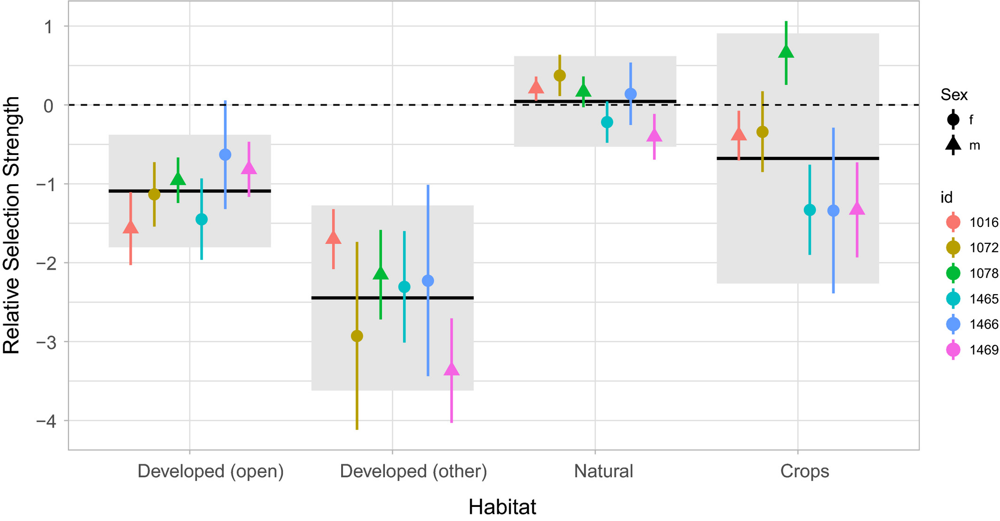
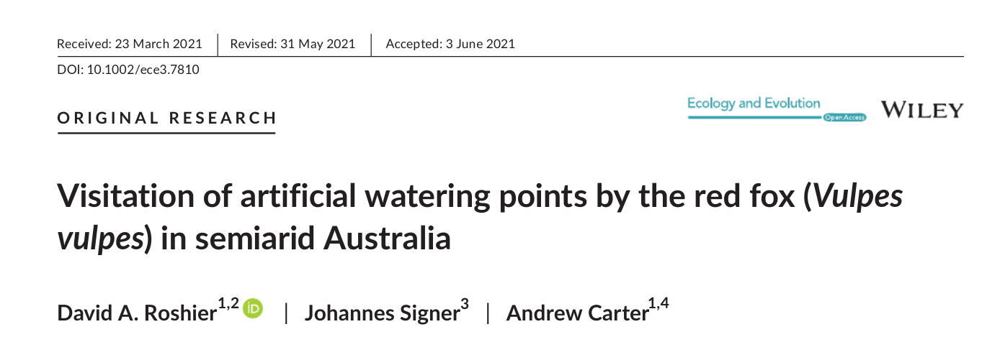
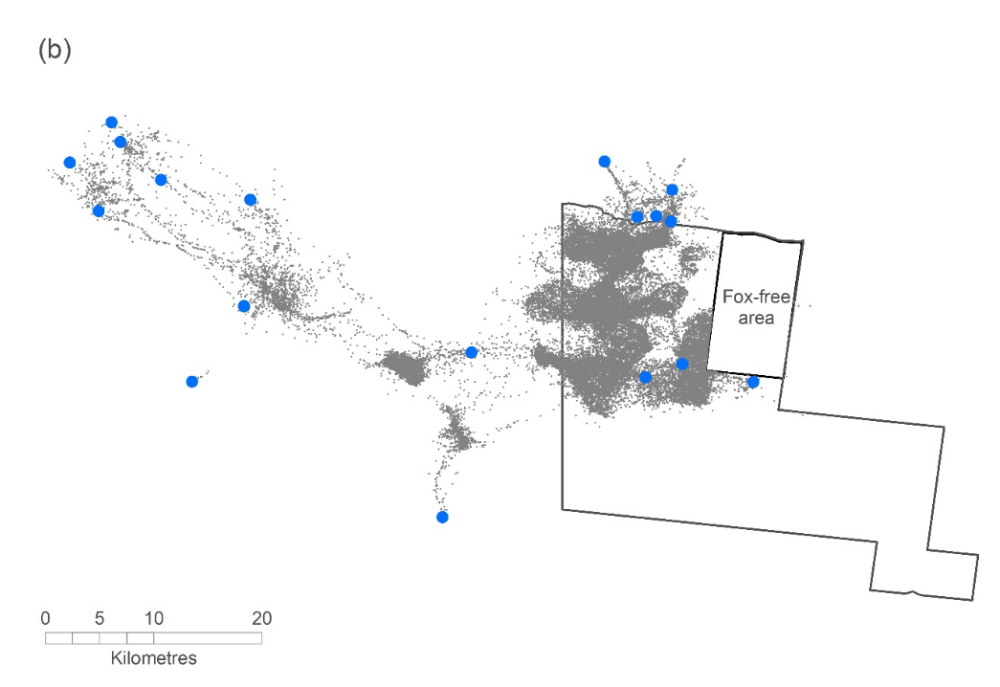
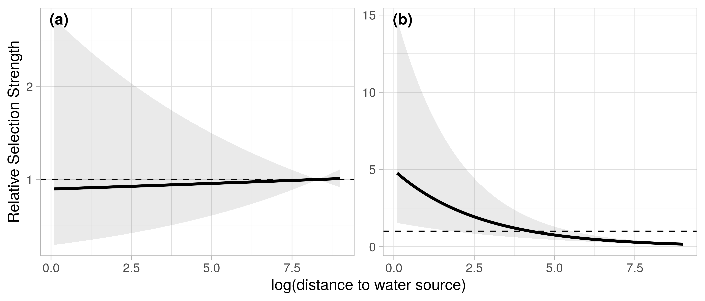
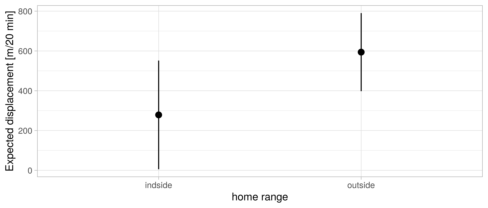

```{r setup, include=FALSE}
library(tidyverse)
knitr::opts_knit$set(root.dir = here::here("09 Multiple Animals"))
knitr::opts_chunk$set(
  echo = TRUE, warning = FALSE, message = FALSE, 
  fig.height = 4, fig.width = 6, cache = FALSE, out.width = "85%", res = 600,
  comment = "", fig.align = "center")
options(width = 70, str = strOptions(strict.width = "wrap"))
theme_set(theme_light()) 
```

# Why should we care?

- Most telemetry studies consist of many animals.
- Often individual behave very differently (and we can fully account for these differences in a model).
- We are often interested in population-level effects.


# How-to account for individual differences

1. ~~Ignore individuals and fit data to all animals.~~
2. Fit an individual model for each individual. 
3. Use a mixed-model strategy. 

-----

\begin{columns}[onlytextwidth,t]
	\begin{column}{0.48\textwidth}
		\textbf{Resource Selection Function}
		\begin{itemize}
			\item Global availability (unmatched)
			\item (weighted) Logistic regression\footnotemark[1]
		\end{itemize}
	\end{column}
	\begin{column}{0.48\textwidth}
		\textbf{Step-Selection Function}
		\begin{itemize}
			\item Availability conditioned on current position (matched)
			\item Conditional logistic regression
		\end{itemize}
	\end{column}
\end{columns}

\begin{figure}
		\includegraphics<2>[height=0.45\textheight]{img/rsf}
		\includegraphics<3>[height=0.45\textheight]{img/ssf1}
		\includegraphics<3>[height=0.45\textheight]{img/ssf10}
\end{figure}

\footnotetext[1]{Fithian \& Hastie. "Finite-sample equivalence in statistical models for presence-only data." The annals of applied statistics 7.4 (2013): 1917.}

# 2. Fit an individual model for each individual. 

- A somewhat naive approach could be, to fit to each individual animal the model of interests (e.g., a SSF or an iSSF).

- In a next step we can then "do statistics" with the coefficients of the individual model. For example, we could 
  - calculate the mean and confidence intervals to obtain population level effects, or 
  - use a linear models to relate coefficient values to other explanatory covariates. 


- A difficulty is if we have extreme observations or some levels of a categorical covariate is not observed for all animals. 

----

There are different programming strategies, how one could approach such a situation: 

a. ~~Write customized code for each individual.~~
b. Use some kind of looping structure (for example a `for`-loop). 
c. Use a nest-unnest approach, as we have seen previously (for example with the `purrr` package). 

----------

An example of this approach was used in Signer et al. 2019

```{r, echo = FALSE, fig.cap="Source Signer et al. 2019"}

```


# 3. Use a mixed-model strategy. 


- For HSF this is *relatively* straight forward. We can make use of well established tools that were developed for GLMMs.

- For iSSFs this is slightly more challenging. We have to use a likelihood equivalent reformulation of the iSSF as a poisson regression with random effects for each strata with a fixed large variance. 

-----

## Random effects for HSFs

	
- Random effects were proposed for HSFs over 15 years ago\footnotemark[2]
	
\pause
\begin{figure}
\includegraphics[width=0.6\linewidth]{img/gillies.png}
\end{figure}
	
\pause

- Majority of studies between 2016 and 2020 (80 %) only include random intercept and no random slope(s).
	
\footnotetext[2]{Gillies et al. "Application of random effects to the study of resource selection by animals." Journal of Animal Ecology 75.4 (2006): 887-898.}
	
	
---

```{r, echo = FALSE}
knitr::read_chunk(here::here("09 Multiple Animals/additional_scripts/goats.R"))
```

- Data on habitat selection of Mountain Goats\footnotemark[3]
-	Generalized linear model with binomial response (GLM), random intercept (GLMM 1), and random intercept and slopes (GLMM 2).


\footnotetext[3]{Lele \& Keim, (2006) Weighted distributions and estimation of resource selection probability functions. Ecology 87, 3021–3028.}

----

Let us fit three models to tracking data from wild goats: 

```{r, eval = FALSE}
<<goat.models>>
```


----

Comparing the model coefficients: 

```{r, echo = FALSE}
knitr::include_graphics(here::here("img/rsf_re.png"))
```

\pause

For RSF use random intercept **and** random slope(s)\footnotemark[4].

\footnotetext[4]{Schielzeth, \& Forstmeier. "Conclusions beyond support: overconfident estimates in mixed models." Behavioral Ecology 20.2 (2008): 416-420.}


# Accounting for animal-specific variation (SSF)


\only<1->{ Conditional logistic regression with random effects is more difficult

\begin{equation*} 
\text{P}(y_{ntj}=1 \,|\, \pmb{x}_{nt\cdot}) = \pi_{ntj} = 
\frac{\exp( \pmb\beta^\top \pmb{x}_{ntj})}
{\sum_{j = 1}^J \exp( \pmb\beta^\top \pmb{x}_{nti})}  
\end{equation*}}
	
- $n = 1, \dots, N$ individuals, with realized steps, 
- time points $t = 1, \dots, T_n$, with 
- $j = 1, \dots, J_{n,t}$ location that were either used or available. 

-----

- The conditional logistic regression is a special case of the multinomial model.
- The multinomial model is likelihood-equivalent to the Poisson model.
- Thus we can rewrite to conditional logistic regression as a Poisson regression.

---- 

## SSF as poisson model

Reformulation as Poisson model\footnotemark[5] \footnotemark[6]

$$
\text{E}(y_{nti}) = \mu_{nti} = \exp(\alpha_{nt} + \pmb\beta^\top \pmb{x}_{nti} + \pmb{u}^\top \pmb{z}_{nti}) \ ,\quad y_{nti} \sim \text{Po}(\mu_{nti})
$$

- $\alpha_{nt} \sim N(0, \sigma_\alpha^2)$ are the stratum specific intercepts with $\sigma_{\alpha}^2$ being fixed at a very large value.
- $\pmb\beta^\top \pmb{x}_{nti}$  are the selection coefficients and the design matrix, respectively.
- $\pmb{u}^\top \pmb{z}_{nti}$ specify the random effect structure.


\footnotetext[5]{Armstrong et al. "Conditional Poisson models: a flexible alternative to conditional logistic case cross-over analysis." BMC medical research methodology 14.1 (2014): 122.}
\footnotetext[6]{Muff, S., et al. "Accounting for individual‐specific variation in habitat‐selection studies: Efficient estimation of mixed‐effects models using Bayesian or frequentist computation". Journal of Animal Ecology, (2020): 89(1), 80-92.}


# Simulation study from Muff et al. 2020
	
- Simulation of movement for 20 animals with animal-specific selection coefficients.
- For RSFs sample random points within the availability domain
- For SSFs sample random steps from each location
	
----
	
## Results HSF
	
\begin{figure}
\includegraphics<1>[width=\linewidth]{img/fig_rsf_fixed_vs_random_intercept1}
\includegraphics<2>[width=\linewidth]{img/fig_rsf_fixed_vs_random_intercept2}
\includegraphics<3>[width=\linewidth]{img/fig_rsf_fixed_vs_random_intercept3}
\end{figure}	
	
	
-----


## Results SSF

\begin{figure}
	\includegraphics<1>[page=1,width=\linewidth]{img/fig_ssf_coefs_wrapper}
	\includegraphics<2>[page=2,width=\linewidth]{img/fig_ssf_coefs_wrapper}
	\includegraphics<3>[page=3,width=\linewidth]{img/fig_ssf_coefs_wrapper}
	\includegraphics<4>[page=4,width=\linewidth]{img/fig_ssf_coefs_wrapper}
\end{figure}	

# An example from Roshier et al. 2021

- This work I did together with David Roshier from Australian Wildlife Conservancy. 
- I was only involved in the statistical modeling. 

```{r, echo = FALSE, out.width="100%", fig.align='center'}

```

---

## Data

- Telemetry data for 22 individual foxes at 20 min sampling rate
- Location of water sources (in blue)

```{r, echo = FALSE, out.width="80%", fig.align='center'}


```

---

## Analysis

1. Revisitation rates with the `recurse` package^[Bracis, C., Bildstein, K. L., & Mueller, T. (2018). Revisitation analysis uncovers spatio‐temporal patterns in animal movement data. Ecography, 41(11), 1801-1811.]
2. aKDE home ranges
3. integrated step selection analysis

----

## Questions: iSSA

- Do foxes select for pixels closer to water sources? 
- Does the selection depends on whether or not foxes are inside their home range?
- Do foxes move faster/slower when inside/outside their home range?

-----

## Habitat selection

Habitat selection of foxes inside (a) and outside (b) of their home range.

```{r, echo = FALSE, out.width="100%"}

```


----

Expected displacement (i.e., how far do we expect a 'typical' fox to travel within a 20 minutes). 


```{r, echo = FALSE, out.width="100%"}

```


	
# Key resources/publications

- Muff, S., Signer, J., & Fieberg, J. (2020). Accounting for individual‐specific variation in habitat‐selection studies: Efficient estimation of mixed‐effects models using Bayesian or frequentist computation. Journal of Animal Ecology, 89(1), 80-92.
- Schielzeth, H., & Forstmeier, W. (2009). Conclusions beyond support: overconfident estimates in mixed models. Behavioral ecology, 20(2), 416-420.

